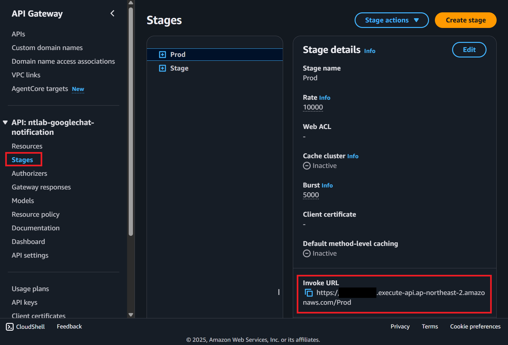
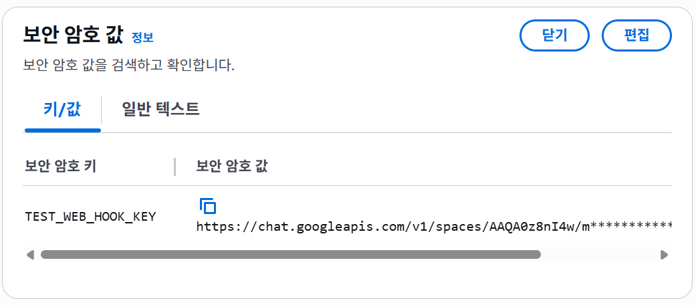

# googlechat-notification ([SAM](https://docs.aws.amazon.com/serverless-application-model/latest/developerguide/what-is-sam.html))

## Language

[한국어](./docs/README_KOR.md)

## Structure


1. When the API Gateway receives an external request, it invokes a Lambda function that forwards the request to SQS.
2. The Publish Lambda validates the user's message and sends it to SQS.
3. When a message arrives in SQS, it triggers the Notification Lambda, which sends a message to Google Chat.
4. Because Google Chat webhooks use URLs that include authentication keys, anyone who has the URL can send messages to the chat. For security reasons, the system does not pass the webhook URL directly as a parameter. Instead, we pass a key that can be used to look up the URL, and Secrets Manager resolves the actual webhook URL.
5. Because SQS provides “at-least-once” delivery, the same notification can be sent multiple times. To ensure idempotency, we use DynamoDB to track and prevent duplicate processing.

## Getting started

Rename `samconfig_back.toml` to `samconfig.toml` and update the values below to reflect your current environment.

``` yaml
[default.global.parameters]
stack_name = "ntlab-googlechat-notification"
region = {Change_to_your_region}

[default.deploy.parameters]
profile = {Change_to_your_profile_name_in_.aws/config_file}
capabilities = "CAPABILITY_IAM"
confirm_changeset = false
```

Execute the following `SAM` commands in order

```
sam build
sam deploy
```

The `sam build` command compiles the code into the `.aws-sam` directory, and `sam deploy` uses that directory to provision actual AWS resources."

## Sending a message

### Check Endpoint
You need to verify the endpoint for sending messages. Once the resources are deployed to AWS via `sam deploy`, check the AWS API Gateway to locate the endpoint URL.



> Invoke URL : {Invoke URL in the picture}/googlechat/notify

To send messages, this API requires a `JSON` payload containing both `webhookKey` and `payload`. The Publish `Lambda` function will return an error if the request is missing these keys. Therefore, you must store the Key and URL data in AWS `Secrets Manager` to resolve the `webhookKey` to the actual Google Chat Webhook URL.

Example


### Message Structure

- webhookKey: The key used to retrieve the Google Chat Webhook URL from AWS `Secrets Manager`.
- payload: A `JSON` object formatted according to the Google Chat CardV2 schema.

Example
``` json
{
   "webhookKey":"my_service",
   "payload":{
      "cardsV2":[
         {
            "cardId":"unique-card-id",
            "card":{
               "header":{
                  "title":"Hello!",
                  "subtitle":"Notification System"
               },
               "sections":[
                  {
                     "header":"Header",
                     "widgets":[
                        {
                           "textParagraph":{
                              "text":"Hello!"
                           }
                        }
                     ]
                  }
               ]
            }
         }
      ]
   }
}
```

## Implementing Idempotency with DynamoDB

`SQS` operates on an 'at-least-once' delivery model, meaning duplicate messages can be delivered at any time. To prevent duplicate processing, I use `DynamoDB` to implement a locking mechanism (optimistic locking) and store the completion status after processing.

### Why I Chose DynamoDB

- Cost Efficiency: Since the system is expected to handle a low volume of notifications, a pay-as-you-go service is the most cost-effective solution.
- TTL Support: The database stores processing status temporarily to ensure exactly-once processing of SQS messages. Unlike traditional RDBs, DynamoDB offers a built-in Time to Live (TTL) feature that automatically expires data without extra management overhead. Plus, TTL deletions in DynamoDB are free of charge.

### Processing Logic

1. Lock Acquisition: Before processing a message, apply the `attribute_not_exists(message_id)` condition to prevent concurrent processing of the same message_id.
2. Completion: Upon successful processing, update the status in the database. If processing fails, delete the item from the database to release the lock.
3. Automatic Cleanup: Configure TTL (Time to Live) on the stored data to prevent indefinite data accumulation.