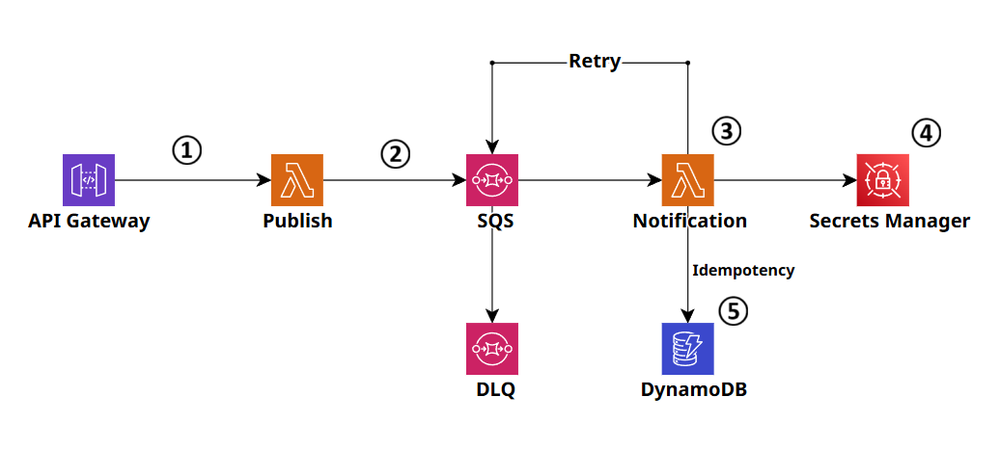
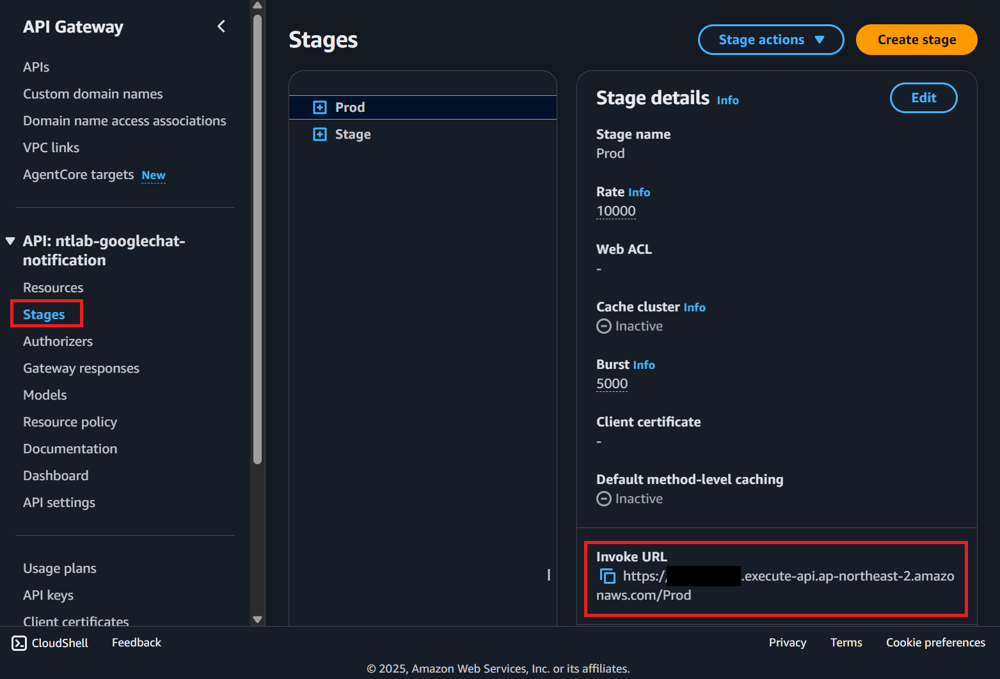
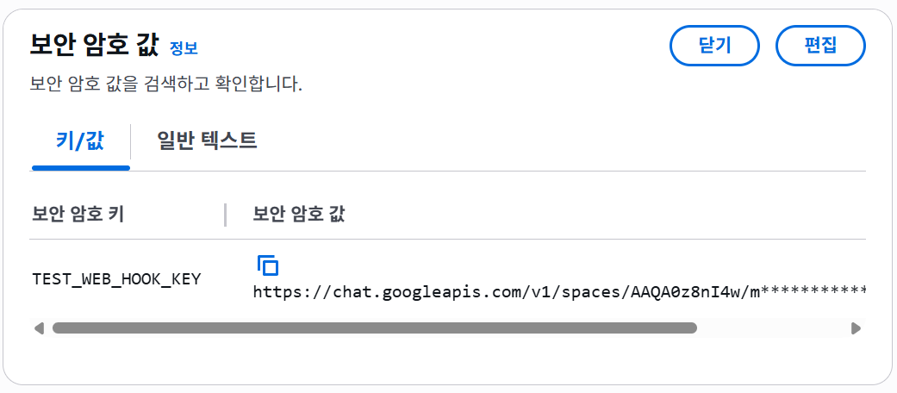

# googlechat-notification ([SAM](https://docs.aws.amazon.com/serverless-application-model/latest/developerguide/what-is-sam.html))

## Language

[한국어](./docs/README_KOR.md)

## Structure



1. `API Gateway`
    Receives external requests and invokes a `Lambda` function to forward them to `SQS`.
2. The `Lambda` function checks whether the incoming message is one we can process, and sends the validated data to `SQS`.
3. When a message arrives in `SQS`, the Notification `Lambda` is triggered.
4. Because Google Chat Webhooks use URLs that include authentication keys, anyone with the URL can send messages to Google Chat. For security reasons, we do not pass the URL directly as a parameter. Instead, we pass a key that can resolve the URL, and `Secrets Manager` resolves the actual Webhook URL.
5. Due to `SQS`'s "at-least-once delivery" model, notifications may be sent more than once. To ensure idempotency, we use `DynamoDB`.

## Getting started

Rename `samconfig_example.toml` to `samconfig.toml` and update the following values to match your environment.

> When changing values, you must wrap them in double quotes `"` (toml rule).

``` yaml
[default.global.parameters]
stack_name = "ntlab-googlechat-notification"
region = "{Change_to_your_region}"

[default.deploy.parameters]
profile = "{Change_to_your_profile_name_in_.aws/config_file}"
capabilities = "CAPABILITY_IAM"
confirm_changeset = false
```

### Prerequisites

The following tools are required to build and deploy this project.

| Tool | Description | Installation |
|------|-------------|--------------|
| [AWS CLI](https://docs.aws.amazon.com/cli/latest/userguide/install-cliv2.html) | AWS resource management and authentication profile setup | [Official Docs](https://docs.aws.amazon.com/cli/latest/userguide/install-cliv2.html) |
| [AWS SAM CLI](https://docs.aws.amazon.com/serverless-application-model/latest/developerguide/install-sam-cli.html) | Build and deploy SAM templates | `pipx install aws-sam-cli` |
| [Docker](https://docs.docker.com/get-docker/) | Required when building with the `--use-container` option | [Official Docs](https://docs.docker.com/get-docker/) |

### Build and Deploy

```
sam build --use-container
sam deploy
```

The `sam build` command compiles the code and creates the `.aws-sam` directory, and the `sam deploy` command uses that directory to provision actual `AWS` resources.

> The `--use-container` option performs the build inside a Docker container. This allows you to build even if you don't have the same Python version as the Lambda runtime installed locally.


## Sending a message

### Check Endpoint
You need to verify the endpoint for sending messages. Once the resources are deployed to `AWS` via `sam deploy`, check the `API Gateway` in `AWS` to locate the endpoint URL.



> Invoke URL: {URL confirmed above}/googlechat/notify

### Secrets Manager Setup

This API requires a `JSON` payload containing both `webhookKey` and `payload` keys to send messages. If a `JSON` request without the `webhookKey` and `payload` keys is received, the Publish `Lambda` will return an error. Therefore, you must store the Key and URL data in `Secrets Manager` so that the `webhookKey` can be resolved to the actual Google Chat Webhook URL.

Example



### Message Structure


- webhookKey: A value that can retrieve the Google Chat Webhook URL from `Secrets Manager`
- payload: A `JSON` object formatted according to the Google Chat [CardV2](https://developers.google.com/workspace/chat/api/reference/rest/v1/cards) schema

Example
``` json
{
   "webhookKey":"TEST_WEB_HOOK_KEY",
   "payload":{
      "cardsV2":[
         {
            "cardId":"unique-card-id",
            "card":{
               "header":{
                  "title":"Hello!",
                  "subtitle":"Notification System"
               },
               "sections":[
                  {
                     "header":"Header",
                     "widgets":[
                        {
                           "textParagraph":{
                              "text":"Hello!"
                           }
                        }
                     ]
                  }
               ]
            }
         }
      ]
   }
}
```

## How to implement idempotency with DynamoDB?

`SQS` operates on an "at-least-once delivery" model. This means that if a message is not properly processed, it can be delivered more than once at any time. To prevent this, we use `DynamoDB` to set a non-preemptive lock on messages and store the completion status upon successful processing.

### Why DynamoDB?

- The current system is expected to send a very low volume of notifications. Therefore, a pay-as-you-go service was deemed the best choice from a cost perspective.
- When a notification is successfully sent, its status is stored in the database, which is used temporarily to ensure each `SQS` message is processed exactly once. In this scenario, a database with TTL (Time to Live) support is needed to automatically clean up data. Traditional RDBs do not offer this feature, making `DynamoDB` an excellent choice. Note that deleting data via TTL in `DynamoDB` is free of charge.

### Processing Logic

1. Before sending a message, apply the `attribute_not_exists(PK)` condition to prevent the same message_id from being processed concurrently while another is already being processed.
2. Upon successful processing, save the result to the database. If processing fails, delete the database entry to release the lock.
3. Data saved to the database upon completion uses TTL to prevent indefinite data accumulation.
