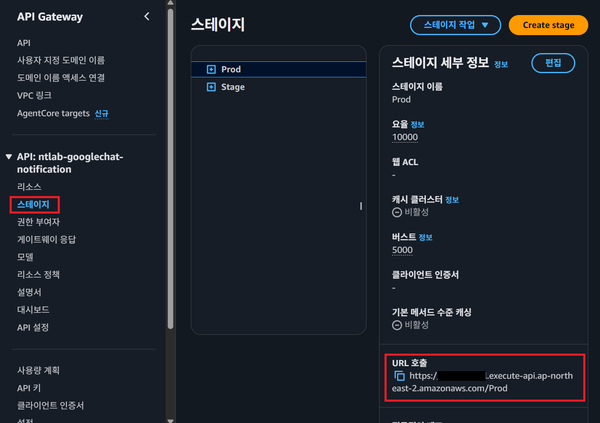

# googlechat-notification ([SAM](https://docs.aws.amazon.com/serverless-application-model/latest/developerguide/what-is-sam.html))


## Structure


1. `API Gateway`
    외부 요청을 수신 후 `SQS`로 전달하기 위해 `Lambda`를 호출합니다.
2. `Lambda`에서 들어온 메시지가 우리가 처리할 수 있는 메시지인지 확인 하고 확인 된 데이터를 `SQS`에 전달합니다.
3. `SQS`에 메시지가 들어오면 Notification `Lambda`가 trigger 됩니다.
4. Google Chat Webhook의 특성상 인증키가 같이 표함 된 URL을 사용하기 때문에 URL만 알면 Google Chat으로 메시지를 보낼 수 있습니다. 그래서 보안을 위해 직접적으로 URL을 파라미터로 넘기지 않고 URL을 Resolve 할 수 있는 Key를 파라미터로 받아 `Secrets Manager`에서 실제 Webhook URL을 Resolve 합니다.
5. '최소 1번 전송' 이라는 `SQS`의 특성으로 인해 여러번 알림이 발송 될 수 있어서 `DynamoDB`를 이용해서 멱등성을 보장합니다.

## Getting started

`samconfig_back.toml`파일의 이름을 `samconfig.toml`로 변경하고 파일 안에 있는 값 중 아래의 값을 현재 상황에 맞게 변경합니다.

``` yaml
[default.global.parameters]
stack_name = "ntlab-googlechat-notification"
region = {Change_to_your_region}

[default.deploy.parameters]
profile = {Change_to_your_profile_name_in_.aws/config_file}
capabilities = "CAPABILITY_IAM"
confirm_changeset = false
```

그 후 `SAM` 명령어를 아래와 같은 순서로 입력합니다.

```
sam build
sam deploy
```

`sam build` 명령어는 코드를 빌드해 `.aws-sam` 폴더를 만들고 `sam deploy` 명령어는 그 폴더를 이용해서 실제 `AWS` 리소스를 만드는 코드입니다.


## Sending a message

### Endpoint 확인
메시지를 보내기 위한 Endpoint를 확인해야 합니다. `sam deploy`를 해서 실제 `AWS`에 리소스가 배포 되었다면 실제 `AWS`의 `API Gateway`를 보고 Endpoint를 확인해야 합니다.



> 호출 URL : {위에서 확인한 URL 호출}/googlechat/notify

### Secrets Manager 설정

이 API는 메시지를 보내기 위해서는 `webhookKey`와 `payload` 키로 이루어진 `json` 데이터를 보내야 합니다.  `webhookKey`와 `payload`키가 없는 `json`이 들어오면 Pulish `Lambda`에서 에러를 리턴합니다. 그래서 `webhookKey`를 가지고 실제 Googlechat webhook url을 해결하기 위해서 `Secrets Manager`에 Key와 URL 데이터를 입력해야합니다.

예시


### Message structure


- webhookKey : Googlechat Webhook url을 `Secrets Manager`로 부터 가져올 수 있는 값 
- payload : Googlechat에서 사용하는 [CardV2](https://developers.google.com/workspace/chat/api/reference/rest/v1/cards?hl=ko) 형식의 `json`

예시
``` json
{
   "webhookKey":"my_service",
   "payload":{
      "cardsV2":[
         {
            "cardId":"unique-card-id",
            "card":{
               "header":{
                  "title":"Hello!",
                  "subtitle":"Notification System"
               },
               "sections":[
                  {
                     "header":"Header",
                     "widgets":[
                        {
                           "textParagraph":{
                              "text":"Hello!"
                           }
                        }
                     ]
                  }
               ]
            }
         }
      ]
   }
}
```

## How to make 멱등성 using DynamoDB

`SQS`는 최소한 1번 전송이라는 방식으로 동작합니다. 그래서 올바로 처리되지 않으면 언제든지 1번 이상의 메시지가 전달 될 수 있습니다. 이것을 막기위해 `DynamoDB`를 사용해서 메시지에 대한 비선점 락을 설정하고 완료시에 완료 상태를 저장할 수 있게 하였습니다.

### DynamoDB를 사용하게 된 이유

- 현재 시스템은 매우 적은 양의 알람을 송신할 것이라고 예상하고 있다. 그래서 사용한 만큼 비용을 지불하는 서비스가 비용적인 문제에서 좋을 것이라고 판단했다.
- 올바로 알람을 발송하면 그 상태가 DB에 저장되는데 이것은 잠시동안 `SQS`의 메시지를 딱 1번만 처리하는 용도로 사용한다. 이런 상황에서는 TTL을 사용해서 데이터를 지울 수 있는 DB가 필요한데 일반적인 RDB에는 이런 기능이 없어서 `DynamoDB`가 좋은 선택일 것이라고 판단했다. 참고로 `DynamoDB`에서 TTL로 데이터를 삭제하는 것은 무료이다.

### 처리방법

1. 메시지를 전송하기 전에 `attribute_not_exists(message_id)` 조건을 주어 message_id가 처리 되는 동안 같은 message_id가 처리되지 못하도록 막는다. 
2. 처리가 완료되면 DB에 저장을 하고 처리가 완료되지 않으면 DB의 값을 지워 락을 해제한다.
3. 처리가 완료 되어 DB에 저장 된 데이터는 저장할 때 TTL을 사용해 데이터가 무한정 쌓이지 않도록 처리한다.