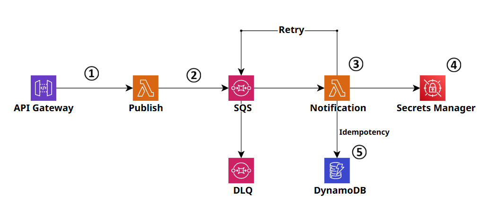

# googlechat-notification ([SAM](https://docs.aws.amazon.com/serverless-application-model/latest/developerguide/what-is-sam.html))


## Structure



1. `API Gateway`
    외부 요청을 수신 후 `SQS`로 전달하기 위해 `Lambda`를 호출합니다.
2. `Lambda`에서 들어온 메시지가 우리가 처리할 수 있는 메시지인지 확인 하고 확인 된 데이터를 `SQS`에 전달합니다.
3. `SQS`에 메시지가 들어오면 Notification `Lambda`가 trigger 됩니다.
4. Google Chat Webhook의 특성상 인증키가 같이 표함 된 URL을 사용하기 때문에 URL만 알면 Google Chat으로 메시지를 보낼 수 있습니다. 그래서 보안을 위해 직접적으로 URL을 파라미터로 넘기지 않고 URL을 Resolve 할 수 있는 Key를 파라미터로 받아 `Secrets Manager`에서 실제 Webhook URL을 Resolve 합니다.
5. '최소 1번 전송' 이라는 `SQS`의 특성으로 인해 여러번 알림이 발송 될 수 있어서 `DynamoDB`를 이용해서 반드시 1번만 알림을 전송할 수 있도록 합니다.

## Getting started

`samconfig_back.toml`파일의 이름을 `samconfig.toml`로 변경하고 파일 안에 있는 값 중 아래의 값을 현재 상황에 맞게 변경합니다.

``` yaml
[default.global.parameters]
stack_name = "ntlab-googlechat-notification"
region = {Change_to_your_region}

[default.deploy.parameters]
profile = {Change_to_your_profile_name_in_.aws/config_file}
capabilities = "CAPABILITY_IAM"
confirm_changeset = false
```

그 후 `SAM` 명령어를 아래와 같은 순서로 입력합니다.

```
sam build
sam deploy
```

`sam build` 명령어는 코드를 빌드해 `.aws-sam` 폴더를 만들고 `sam deploy` 명령어는 그 폴더를 이용해서 실제 `AWS` 리소스를 만드는 코드입니다.


## Sending a message

